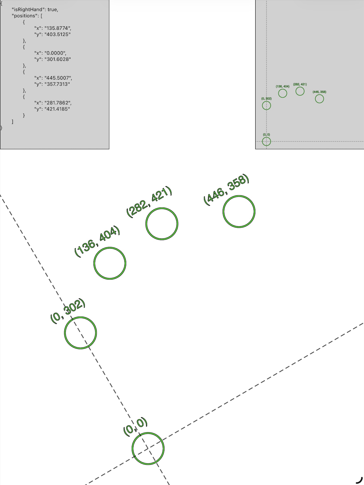

# Resting Hand Mapper

### Description

A supporting app for a later project, detects and outputs the relative positions of fingers placed on the screen. 



### To do

1. Add a way to get scale, current positions are in arbitrary pixels, we need an object of a known size to get inches
2. Add a way to average hand layouts over multiple placements for increased accuracy

### How to run

You can visit the [pages sight](https://mattriggle05.github.io/resting-hand-mapper/) for this repository or simply serve the root folder of the project with your tool of choice, everything is vanilla HTML, CSS, or JS

Python3
```bash
python3 -m http.server 8000
```

Node.js
```bash
npx serve .
```